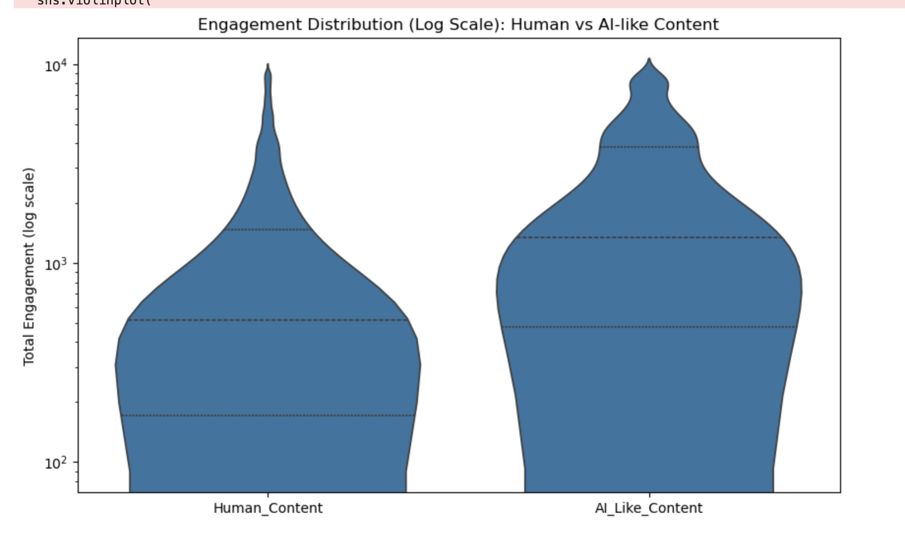
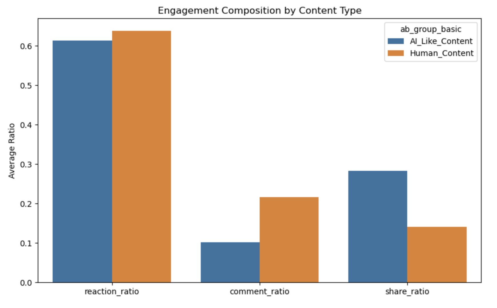
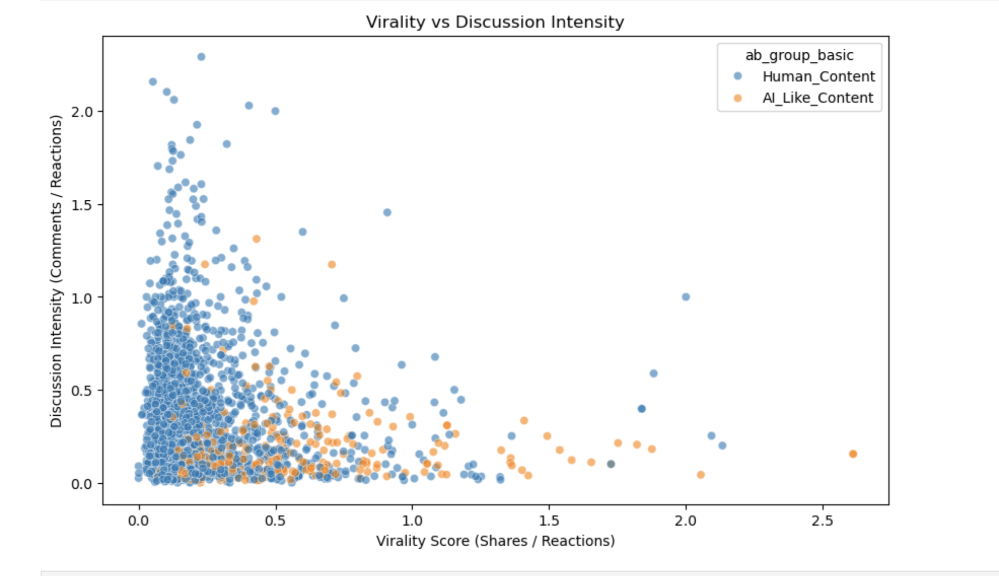
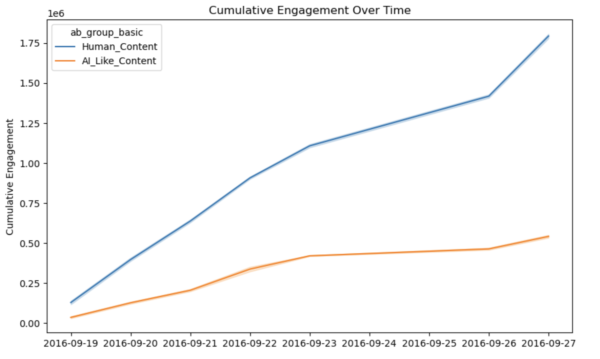
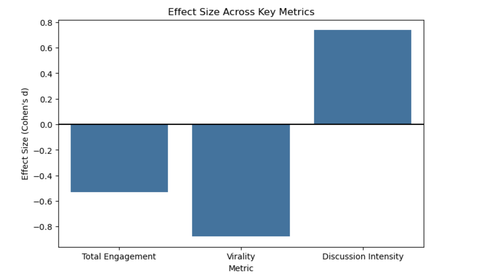

The Story: Human Credibility vs. AI-Like Virality
The modern digital landscape is a battlefield between factual information and high-velocity misinformation. This project tells the story of how Human Content (verified, factual news) competes for attention against AI-Like Content (sensationalized, mixed, or false information).

By segmenting data into these two groups, the analysis reveals a sobering reality: while factual content maintains a higher total volume of posts, misinformation is often engineered to be more viral, spreading through active shares rather than just passive reactions. The narrative shifts from simply asking how many likes a post received to analyzing the quality and intent of the engagement.

2. Technical Roadmap: Data Engineering & Pipeline
To arrive at these insights, a multi-stage technical pipeline was executed across four primary software environments.

Data Cleaning and Preprocessing (Excel & Python)
Raw social media data is notoriously messy. The project began with a high-level audit in Excel to identify "Categorical Drift." Fact-checkers used numerous labels like "mostly true" or "mixture." Excel allowed for the initial mapping of these into two logical buckets: Human Content and AI-Like Content.

Python then handled the heavy lifting of data integrity:

Deduplication: Removing identical post IDs to ensure metrics like "Total Engagement" were not artificially inflated.

Integrity Checks: Filtering out rows with negative reaction counts or missing URLs.

Statistical Noise: Using the Interquartile Range (IQR) method in Python to detect engagement levels so extreme they likely resulted from bot activity or artificial boosting.

The Engine of Scale (SQL)
While Excel was used for auditing, SQL was the engine of scale. Social media datasets contain tens of thousands of records, making manual analysis impossible.

Engagement Tiering: Using SQL Window Functions like NTILE(3), we segmented posts into three tiers. This allowed us to target the "Top Tier"—the posts that reached the largest audience.

High-Risk Identification: We wrote complex queries to filter for posts in the top engagement tier that carried "false" or "mixture" ratings, creating a "High-Risk Post List."

Publisher Metrics: SQL calculated the average engagement per publisher to identify "Misinformation Engines"—pages consistently producing high-engagement, low-truth content.

3. Deep Business & Analytical Insights
The data provided several critical "aha!" moments for media strategy and platform safety:

The Virality Gap (Python & SQL)
We engineered a Virality Score (Shares divided by Reactions).

Insight: AI-Like content consistently showed a higher Virality Score. This suggests misinformation is specifically designed to be "weaponized"—it is not just consumed; it is passed on.

Business Impact: Platforms can use this ratio as an early warning system. A post with a share-to-reaction ratio above a specific threshold (e.g., 1.5) is a candidate for immediate fact-checking.

Engagement Composition
We broke engagement into three pillars: Reactions, Comments, and Shares.

Finding: Human content has a higher "Reaction Ratio" (passive agreement), while AI-Like content skews toward "Share Ratios" (active distribution).

Discussion Intensity: We created a metric (Comments divided by Reactions) to measure controversy. "Mixed" content often had the highest intensity, indicating it was designed to spark polarizing debate.

Data Visualization Questions and Insights

This project explores how Human-generated and AI-like content behave across engagement, virality, and credibility.

1. Engagement Distribution Analysis

Question:
Do Human vs AI-like content behave differently across the entire distribution, not just averages?

Analysis:
The distribution shows that AI-like content has a wider spread with higher peaks in engagement, indicating more variability. Human content appears more stable but less extreme.

Insight:
AI-like content can achieve higher engagement spikes but is less consistent, while human content maintains steady engagement.

2. Engagement Composition (Depth vs Volume)

Question:
How are users engaging — reacting, commenting, or sharing?

Analysis:
Human content generates more comments, indicating deeper engagement. AI-like content drives more shares, indicating broader reach. Reaction levels are similar across both.

Insight:
Human content encourages discussion, whereas AI-like content spreads faster across audiences.

3. Virality vs Credibility

Question:
Is low-credibility content more viral?

Analysis:
The scatter plot shows that content with lower credibility tends to achieve higher virality scores, although with lower discussion intensity.

Insight:
Highly viral content is not always credible, highlighting a trade-off between reach and reliability.

4. Cumulative Engagement Over Time

Question:
Which content type sustains engagement over time?

Analysis:
Human content shows a steady and continuous increase in engagement over time, while AI-like content grows more slowly and plateaus earlier.

Insight:
Human-generated content sustains long-term engagement better than AI-like content.

5. Effect Size Analysis

Question:
How significant are the differences between Human and AI-like content?

Analysis:
Effect size results indicate differences in total engagement, virality, and discussion intensity between the two content types.

Insight:
The differences are statistically meaningful, especially in how users interact with the content.

4. Challenges Faced & Solutions
Working with this dataset presented significant statistical hurdles:

The Power Law Challenge: Most posts get zero engagement, while a few get millions. To solve this, Python applied a Log Transformation (log10) to engagement metrics, allowing us to visualize patterns that would otherwise be invisible.

Volume vs. Impact: Factual news had 10x the post volume, but misinformation had 3x the engagement per post. We solved this by moving away from "Total Sums" and focusing on Weighted Averages and Engagement Tiers to show the true impact of viral falsehoods.

5. Communication Layer: Strategic Visualization (Tableau)
The final stage was translating these technical findings into a language for decision-makers using Tableau.

Command Center Dashboard: We created a dashboard visualizing the "Engagement Spread" and "Publisher Risk Leaderboard."

Visual Evidence: Tableau scatter plots showed the direct relationship between low credibility and high virality, proving that misinformation is mathematically more likely to be shared than factual news.

Post Type Performance: The visualization revealed that photos and videos were more susceptible to carrying viral misinformation than standard links, allowing moderation teams to prioritize specific media formats.

6. Solving Real-Life Problems
This integrated solution translates into three real-world applications:

Content Moderation at Scale: Instead of trying to fact-check every post, platforms can use the High Risk Flag (Top Tier + High Virality) to focus on the 1% of content causing 90% of the harm.

Brand Safety for Advertisers: The project provides a framework for a "Credibility Scorecard," allowing brands to blacklist publishers who consistently produce high-risk viral content.

Public Policy: The Cumulative Engagement Curve shows how misinformation "lives" longer in the ecosystem, helping policymakers design "pre-bunking" campaigns to educate the public before a misinformation curve peaks.
